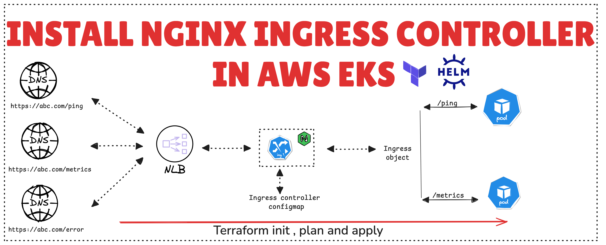

### Lesson 2: Install NGINX Ingress Controller in AWS EKS

This lesson covers the steps to install and configure an NGINX Ingress Controller in your EKS cluster, enabling you to manage external access to your Kubernetes services.


# Before getting started:
1. Follow the instructions from the previous video to <b>create a EKS cluster with v1.30</b>

## Medium Article Link:
- [Read the detailed guide on Medium](https://medium.com/@ravindrasinghh/install-nginx-ingress-controller-in-aws-eks-890dc9c4ff72)

## Youtube Article Link:
- [Watch the Tutorial on YouTube](https://www.youtube.com/PYO0OFYNI5A)

Before you begin, ensure you have the following installed:

- [Terraform](https://www.terraform.io/downloads.html) v1.0 or later
- AWS CLI configured with appropriate credentials
- [kubectl](https://kubernetes.io/docs/tasks/tools/) for interacting with your EKS cluster

### Step 1: Clone the Repository

```
git clone git@github.com:ravindrasinghh/Kubernetes-Playlist.git
cd Kubernetes-Playlist/Lesson1/
Include the above configurations files in your Terraform code to install the nginx ingress controller
```

### Step 2: Add nginx.tf file 
```
resource "helm_release" "ingress-nginx" {
  name             = "ingress-nginx"
  repository       = "https://kubernetes.github.io/ingress-nginx"
  chart            = "ingress-nginx"
  namespace        = "ingress-nginx"
  create_namespace = true
  version          = "4.10.0"
  values           = [file("./nginx.yaml")]
  set {
    name  = "controller.service.annotations.service\\.beta\\.kubernetes\\.io/aws-load-balancer-ssl-cert"
    value = module.acm_backend.acm_certificate_arn
    type  = "string"
  }
}
```
### Step 3: Add nginx.yaml file 
```
controller:
  replicaCount: 2
  minAvailable: 1
  resources:
    limits:
      cpu: 500m
      memory: 512Mi
    requests:
      cpu: 100m
      memory: 256Mi
  autoscaling:
    enabled: true
    annotations: {}
    minReplicas: 2
    maxReplicas: 6
    targetCPUUtilizationPercentage: 70
    targetMemoryUtilizationPercentage: 80
    behavior:
     scaleDown:
       stabilizationWindowSeconds: 60
  updateStrategy:
    type: RollingUpdate
    rollingUpdate:
      maxUnavailable: 1
  service:
    annotations:
      service.beta.kubernetes.io/aws-load-balancer-backend-protocol: tcp
      service.beta.kubernetes.io/aws-load-balancer-cross-zone-load-balancing-enabled: 'true'
      service.beta.kubernetes.io/aws-load-balancer-type: nlb
      service.beta.kubernetes.io/aws-load-balancer-ssl-ports: https
      service.beta.kubernetes.io/aws-load-balancer-ssl-negotiation-policy: 'ELBSecurityPolicy-TLS13-1-2-2021-06'
      service.beta.kubernetes.io/aws-load-balancer-proxy-protocol: "*"
    targetPorts:
      http: http
      https: http
```
### Step 4: Verifying the Installation
```
1. kubectl get pods -n ingress-nginx
2. kubectl get services -n ingress-nginx
```
### Step 5: An example Ingress YAML file to support the demo and assist with the implementation.
```
apiVersion: apps/v1
kind: Deployment
metadata:
  name: photoapp
spec:
  selector:
    matchLabels:
      app: photoapp
  replicas: 3
  template:
    metadata:
      labels:
        app: photoapp
    spec:
      containers:
      - image: ravindrasingh6969/nodeapp:latest
        name: photoapp
        ports:
        - containerPort: 8080
---
apiVersion: v1
kind: Service
metadata:
  name: photoapp
spec:
  ports:
  - port: 80 #service port  #kubeproxy will open port on worker node to which can route traffic to alb
    targetPort: 8080 #container port
    protocol: TCP
  type: ClusterIP
  selector:
    app: photoapp
---
apiVersion: networking.k8s.io/v1
kind: Ingress
metadata:
  name: photoapp
  annotations:
    # AWS-specific annotations for SSL and the load balancer
    alb.ingress.kubernetes.io/scheme: "internet-facing"
    alb.ingress.kubernetes.io/target-type: "ip"
    alb.ingress.kubernetes.io/listen-ports: '[{"HTTP": 80}, {"HTTPS": 443}]'
    alb.ingress.kubernetes.io/certificate-arn: "arn:aws:acm:ap-south-1:434605749312:certificate/9c87dc98-73ca-40f8-a731-280b943ea7f3"
    alb.ingress.kubernetes.io/ssl-redirect: '443'
spec:
  ingressClassName: nginx
  rules:
    - host: myapp.codedevops.cloud
      http:
        paths:
          - path: /
            pathType: Prefix
            backend:
              service:
                name: photoapp
                port:
                  number: 80
          - path: /ping
            pathType: Prefix
            backend:
              service:
                name: photoapp
                port:
                  number: 80
          - path: /metrics
            pathType: Prefix
            backend:
              service:
                name: photoapp
                port:
                  number: 80  
          - path: /error
            pathType: Prefix
            backend:
              service:
                name: photoapp
                port:
                  number: 80 
```
## Troubleshooting
If you encounter any issues, refer to the Nginx ingress documentation or raise an issue in this repository.
