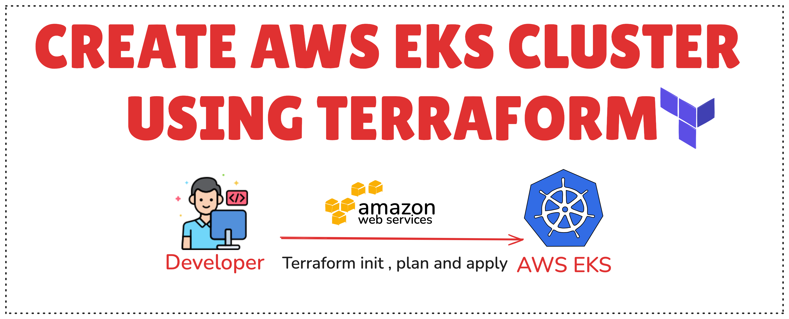
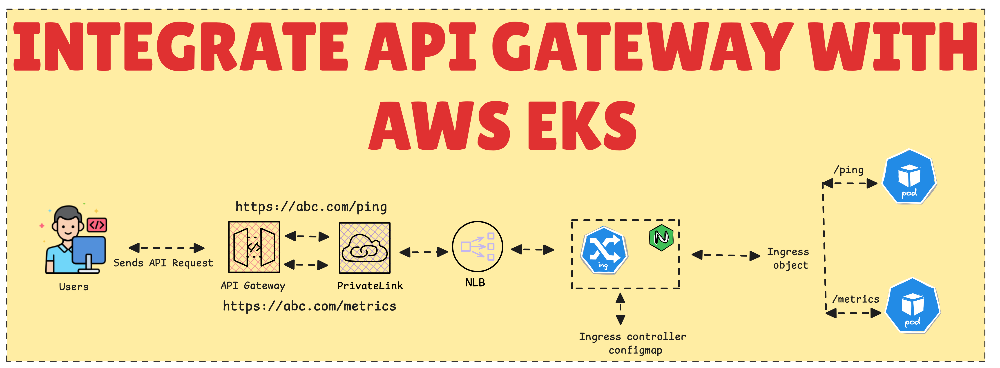

# Kubernetes-Playlist

This repository provides a comprehensive guide and Terraform scripts to set up an Amazon EKS cluster, install an NGINX Ingress Controller, and integrate an API Gateway with AWS EKS NLB.

### Lesson 1: Create an EKS Cluster using Terraform
In this lesson, you'll learn how to create an Amazon EKS cluster using Terraform. The configuration includes setting up VPC, subnets, security groups, and the EKS cluster itself.

### Lesson 2: Install NGINX Ingress Controller in AWS EKS
This lesson covers the steps to install and configure an NGINX Ingress Controller in your EKS cluster, enabling you to manage external access to your Kubernetes services.

### Lesson 3: Integrate API Gateway with AWS EKS NLB
In this lesson, you'll integrate an AWS API Gateway with the Network Load Balancer (NLB) in your EKS cluster, allowing you to expose your services via a secure API endpoint.

### Lesson 4: Install ArgoCD and Securing Access Using Amazon Cognito
In this lesson, you will learn how to install ArgoCD using a Helm chart and secure ArgoCD access with Amazon Cognito.

### Lesson 5: EKS & NGINX Monitoring with Prometheus, Grafana, and Alerts
#TBD 
